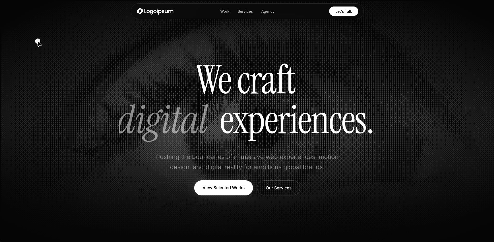

# AURA — Creative Agency Template



A production-ready, high-performance creative agency landing page built with Svelte 5, Tailwind CSS v4, and GSAP. Inspired by Awwwards-winning spatial design patterns, this template features hardware-accelerated motion, complex spatial typography, and a meticulously crafted elite dark-mode aesthetic.

## Architecture & Stack

- **Framework:** Svelte 5 (Runes) + SvelteKit
- **Styling:** Tailwind CSS v4
- **Animation Engine:** GSAP 3 (ScrollTrigger, ScrollToPlugin)
- **Scroll Hook:** Lenis (Smooth Scroll)

## Core Capabilities

- **Spatial Typography:** Responsive, screen-filling typography masking interactive layout layers.
- **Hardware-Accelerated Stacking:** 3-column sticky panel grid that natively scales and dims underlying layers via GSAP ScrollTrigger.
- **Micro-Interactions:** Ultra-soft, minimalist testimonial crossfader utilizing robust GSAP Timelines.
- **Parallax Marquee:** Linear endless scrolling engine built for partner arrays.
- **Fluid Navigation:** Custom GSAP implementations for zero-latency anchor traversals and glassy mobile interfaces.

## Local Environment

Ensure you have Node.js (v20+) installed on your machine.

```bash
# Install node packages
npm install

# Initialize the Vite development server
npm run dev

# Compile the production bundle
npm run build
```

## Component Structure

Primary UI construction operates out of `src/lib/components`:
- `Hero.svelte` - Main entry cinematic
- `Showcase.svelte` - Custom 3D stacking interaction logic
- `Brands.svelte` - Infinite scrolling partner arrays
- `Testimonials.svelte` - Minimalist auto-fading quote engine
- `WorksList.svelte` - Selected works with rich hover-states
- `Seo.svelte` - Pre-configured `<svelte:head>` metadata injection
- `header.svelte` - Glassmorphism navigation with dynamic routing

## License

Engineered by [YusufCeng1z](https://github.com/YusufCeng1z).
Released and open-sourced under the MIT License.
